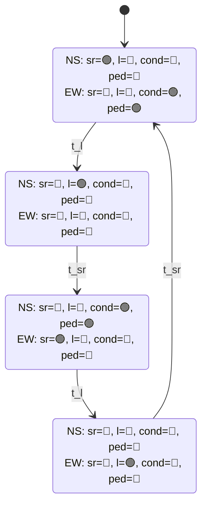

# traffic-control-system

## Opis

Symulacja skrzyżowania 4-wlotowego z 2 pasami w każdą stronę (lewy pas do skrętu w lewo, prawy pas do jazdy na wprost lub skrętu w prawo). Sygnalizacja składa się z:

- sygnału kierunkowego (bezkolizyjnego) w lewo,
- sygnału ogólnego na wprost i w prawo,
- strzałki warunkowej w prawo,
- świateł dla pieszych.

Dodatkowo zaimplementowane są przyciski dla pieszych, zmieniające ich światło na zielone w przypadku małego obciążenia skrzyżowania.

Program składa się z dwóch części:

- programu Node.js napisanego w języku TypeScript, który po podaniu pliku wejścia i wyjścia zasymuluje podany scenariusz ruchu drogowego,
- aplikacji internetowej React przedstawiającej graficznie ruch na skrzyżowaniu po wczytaniu nagrania symulacji.

## Instalacja i używanie

Należy mieć zainstalowaną wersję LTS Node.js (ja używałem `v22.12.0`) razem z npm (ja używałem `11.3.0`).
Następnie w katalogu głównym `npm i` żeby zainstalować wszystkie biblioteki.

### Symulacja

Aby uruchomić należy w katalogu `sim`:

- najpierw `npm run build`,
- potem `npm run start input.json output.json optional_recording.json`.

<details>
<summary>Format pliku wejściowego</summary>

```jsonc
{
    // Ustawienia algorytmu zmian faz
    // Ten obiekt jest opcjonalny
    "config": {
        "states": {
            "NS_SR": {
                "greenMinCarsThreshold": "number",
                "greenMin": "number",
                "greenMax": "number",
                "ratio": "number",
                "ratioCarsLimit": "number",
            },
            "NS_L": {
                "greenMinCarsThreshold": "number",
                "greenMin": "number",
                "greenMax": "number",
                "ratio": "number",
                "ratioCarsLimit": "number",
            },
            "EW_SR": {
                "greenMinCarsThreshold": "number",
                "greenMin": "number",
                "greenMax": "number",
                "ratio": "number",
                "ratioCarsLimit": "number",
            },
            "NS_L": {
                "greenMinCarsThreshold": "number",
                "greenMin": "number",
                "greenMax": "number",
                "ratio": "number",
                "ratioCarsLimit": "number",
            },
        },
        "pedRequestMaxCars": "number",
    },

    // Lista komend, poniżej przedstawiam wszystkie typy komend
    "commands": [
        {
            "type": "addVehicle",
            "vehicleId": "string",
            "startRoad": "north | south | east | west",
            "endRoad": "north | south | east | west",
        },
        {
            "type": "step",
        },
        // Dodatkowo
        {
            "type": "pedestrianRequest",
            // Po której stronie skrzyżowania pieszy chce przejść (np. north = przechodzi po północnej stronie z zachodu na wschód lub ze wschodu na zachód)
            "crossing": "north | south | east | west",
        },
    ],
}
```

</details>

<!-- prettier-ignore -->
> [!IMPORTANT]
> `optional_recording.json` to opcjonalny argument do programu. Jeżeli występuje, to do niego zostanie wpisany każdy stan symulacji. Następnie ten plik można załadować w aplikacji internetowej do graficznego odtworzenia symulacji.

Dodatkowo można uruchomić testy za pomocą `npm run test` w katalogu `sim`. Zaimplementowałem zarówno testy jednostkowe jak i integracyjne oraz skonfigurowałem workflow w GitHub Actions. Testy integracyjne porównują wszystkie stany symulacji z zapisanymi wcześniej w pliku. Dzięki temu wiadomo kiedy nastąpi zmiana powodująca inne działanie algorytmu.

### Aplikacja internetowa

Aby uruchomić aplikację internetową należy w katalogu `web`:

- uruchomić najpierw `npm run build`,
- potem `npm run start`.

Strona internetowa będzie dostępna na `http://localhost:4173`. Jeśli wcześniej uruchomiono symulację z dodatkowym argumentem z nazwą pliku, to można ten plik wczytać w aplikacji internetowej i odtworzyć symulację. Dodatkowo po najechaniu kursorem na dany pojazd możemy zobaczyć jego id.


## Algorytm

Fazy świateł są zmieniane na bazie [automatu skończonego](https://pl.wikipedia.org/wiki/Automat_sko%C5%84czony) przedstawionego poniżej.
Światła żółte oraz czerwone-żółte nie są symulowane, ponieważ wtedy należałoby niepotrzebnie wstawiać mnóstwo `{ "type": "step" }` do wejścia symulacji, ale dzięki mojej reprezantacji faz byłyby one bardzo łatwe do zaimplementowania.



### Legenda

- `N`, `S`, `E`, `W` - północ, południe, wschód, zachód
- `sr` - na wprost i w prawo
- `l` - w lewo
- `cond` - warunkowo w prawo ("strzałka")
- `ped` - piesi (tutaj zielone dla np. kierunku `NS` oznacza, że piesi mogą przejść po stronie `N` oraz `S` skrzyżowania)
- `t_l` - zmienia stan gdy:
    - upłynął minimalny czas trwania światła zielonego **ORAZ**
        - (liczba wszystkich pojazdów jadących na pasach `sr` we wszystkich kierunkach <= `ratioCarsLimit` **ORAZ** stosunek pojazdów stojących na czerwonym do pojazdów jadących >= `ratio`)
        - **LUB** (liczba pojazdów na pasie `sr` w obecnym kierunku == 0 **ORAZ** liczba pojazdów na pasie `l` > 0)
        - **LUB** (pieszy nacisnął przycisk **ORAZ** ilość pojazdów na pasie `sr` w obecnym kierunku <= `pedRequestMaxCars`)
    - **LUB** upłynął maksymalny czas trwania światła zielonego
- `t_sr` - zmienia stan gdy:
    - (upłynął minimalny czas trwania światła zielonego **ORAZ** ilość pojazdów na pasach `l` w obecnym kierunku == 0)
    - **LUB** (upłynął maksymalny czas trwania światła zielonego)
